# 📱 Aplikasi Sewa Kendaraan GORENT
### Project Ujian Akhir Semester (UAS)

Aplikasi Sewa Kendaraan adalah aplikasi mobile berbasis **Flutter** yang digunakan untuk mengelola data kendaraan yang akan disewakan.  
Pengguna dapat menambahkan kendaraan, memilih jenis kendaraan, serta menentukan fitur-fitur yang tersedia pada kendaraan tersebut.

Aplikasi ini terintegrasi dengan **Firebase Firestore** sebagai media penyimpanan data secara online.

---

## 🎯 Tujuan Aplikasi

- Memudahkan pemilik kendaraan dalam mendaftarkan kendaraan yang akan disewakan
- Memudahkan Penyewa untuk mencari kendaraan dikota manapun
- Menyediakan informasi kendaraan secara terstruktur dan rapi
---

## ✨ Fitur Aplikasi

- Input data kendaraan
- Pemilihan jenis kendaraan:
  - Mobil
  - Motor
  - Bus
- Pemilihan fitur kendaraan:
  - AC
  - Audio
  - GPS
  - dll
- Menyewa Kendaraan
---

## 🛠️ Teknologi yang Digunakan

- Flutter
- Dart
- Firebase Firestore
---

## 👥 Kelompok

| Nama | Peran |
|------|------|
| Rifki Muhamad Fauzi | Backend Developer |
| Riki Gusti | Backend Developer |
| Akmal Yusril Fani | Frontend Developer |
| Nisa Silva Triana | Frontend Developer |
| Natalia Margaretha | Frontend Developer |

---

## 📸 Screenshot Tampilan Aplikasi

### Splash Screen
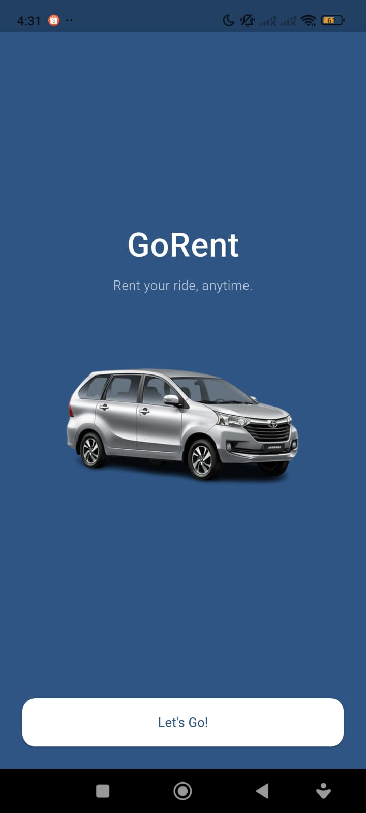

### Login
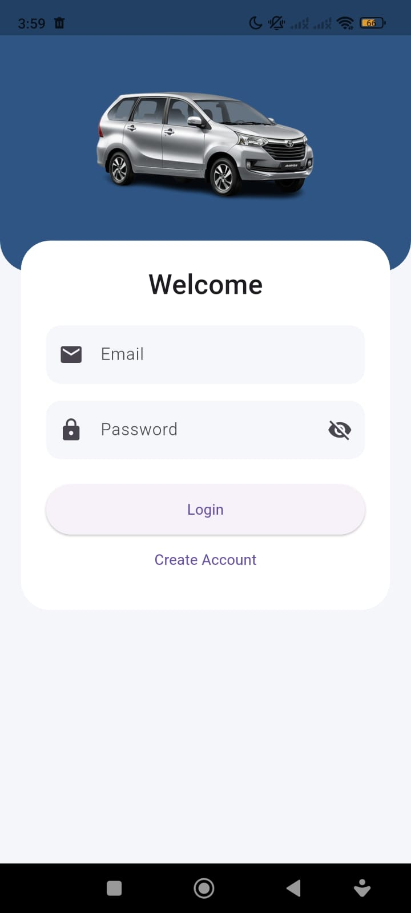

### Register
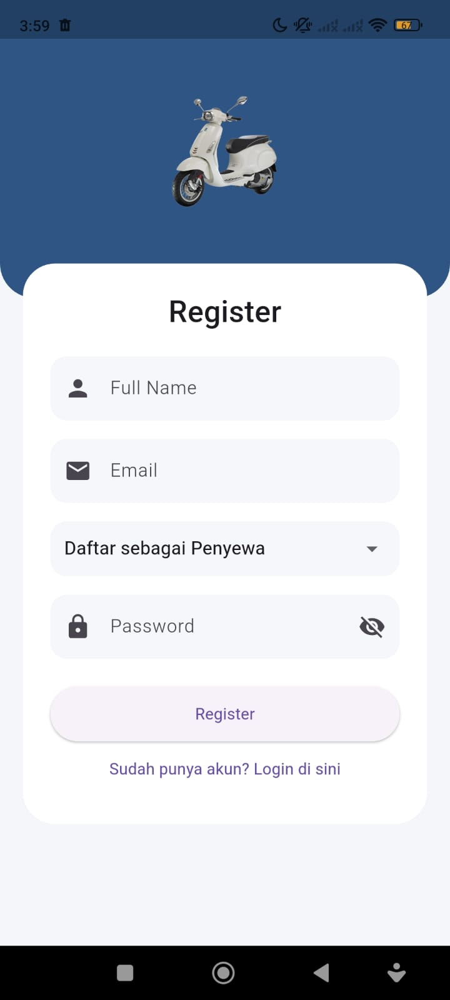

### About
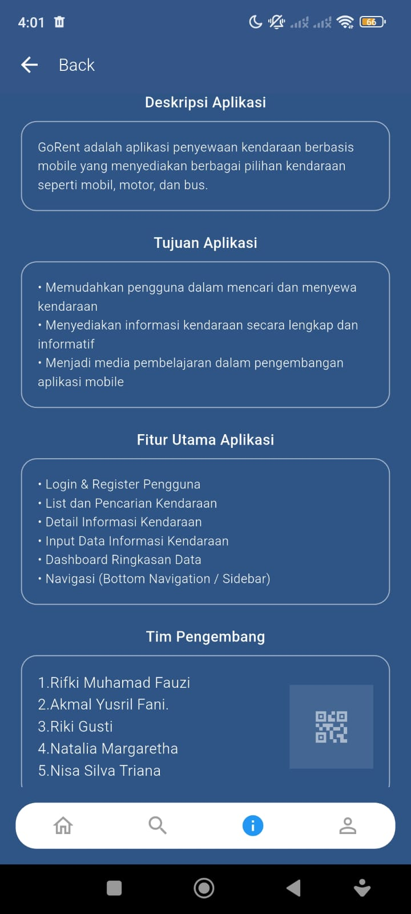

### Dashboard Renter(Owner)
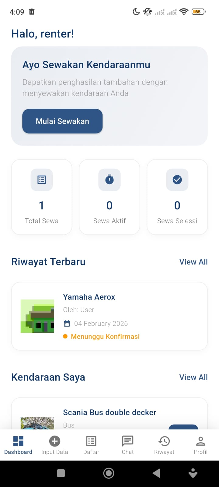

### Input Data Kendaraan(Owner)
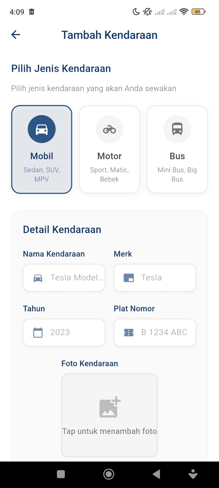

### List Kendaraan(Owner)
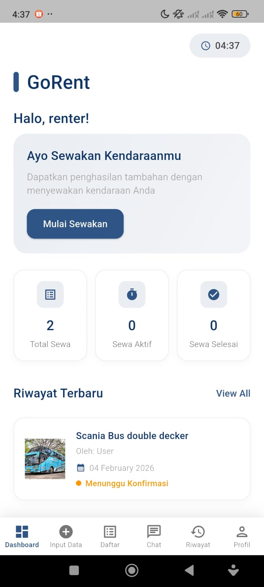

### Riwayat Chat POV (Owner)
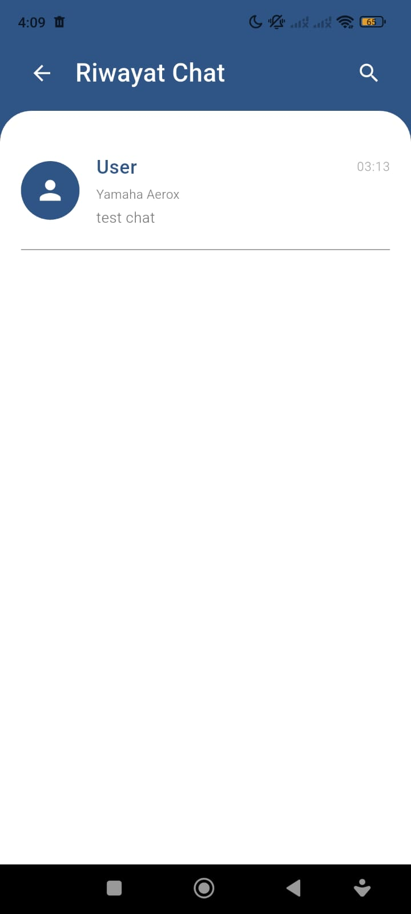

### CHAT POV (Owner)

### Riwayat Penyewaan (Owner)
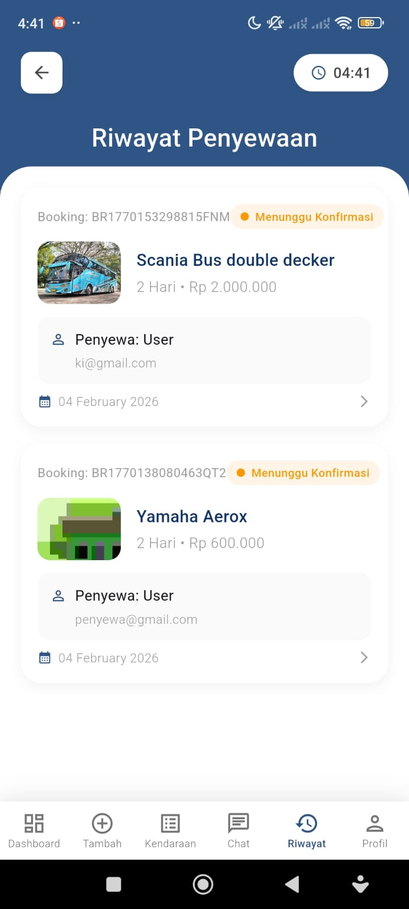

### Profile (Owner)
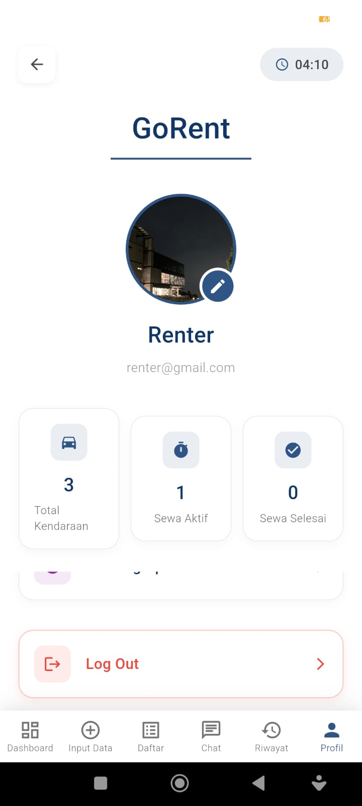

### Dashboard (Penyewa)
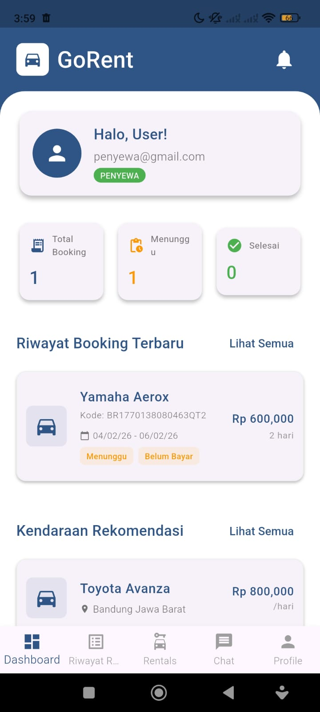

### Menu List Kendaraan (Penyewa)
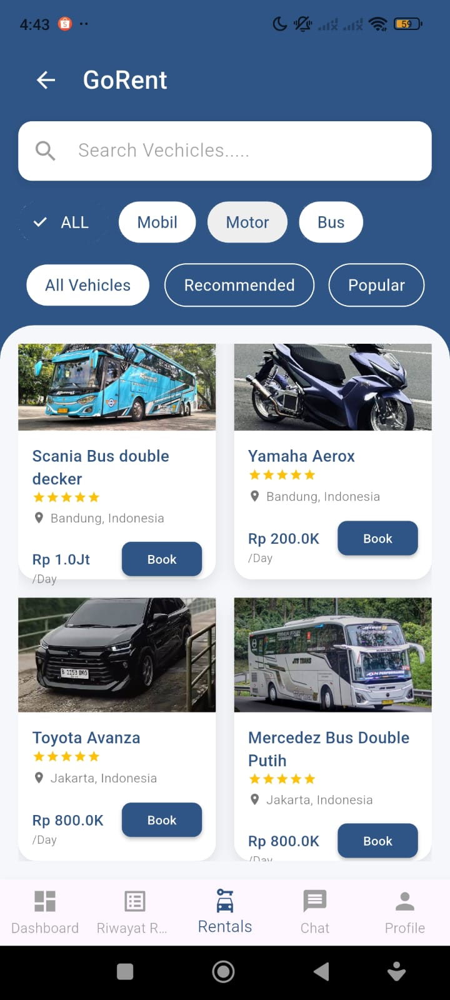

### Detail Kendaraan (Penyewa)

### Filter Recomend (Penyewa)
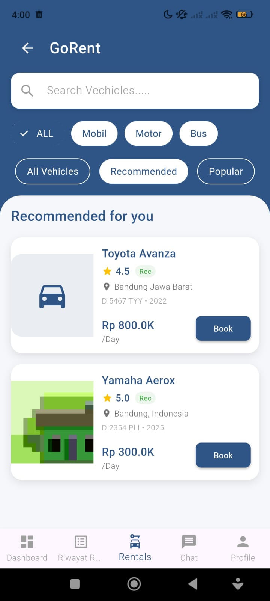

### Filter Popular (Penyewa)
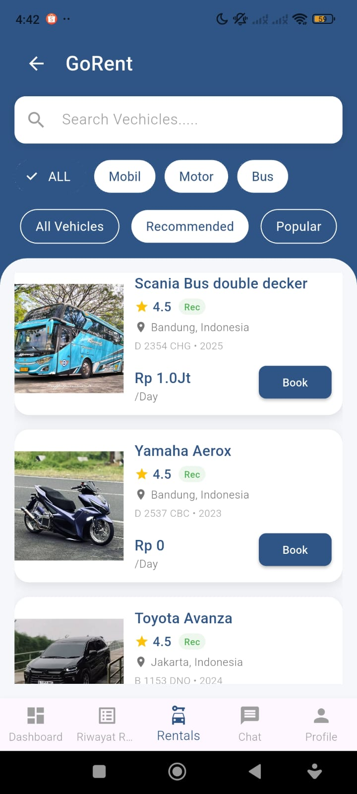

### Filter Mobil (Penyewa)
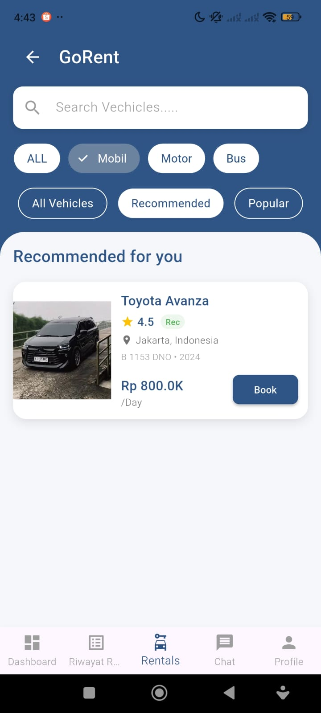

### Filter Motor (Penyewa)

### Filter Bus (Penyewa)
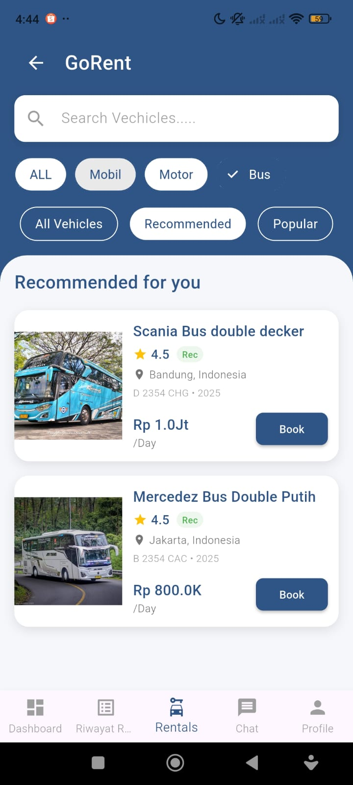

### Riwayat Booking (Penyewa)
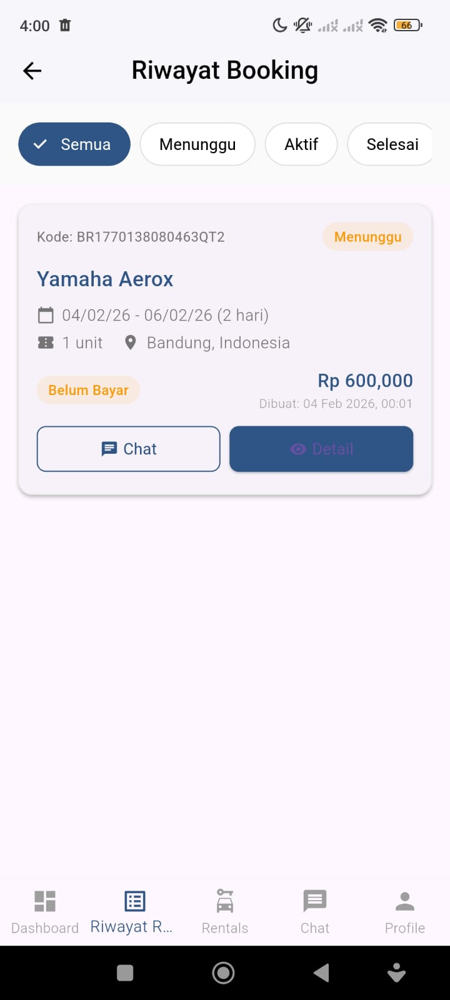

### Detail Booking (Penyewa)
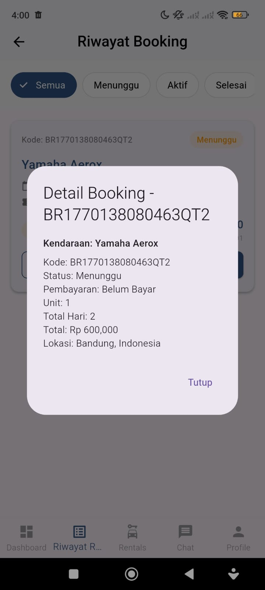

### Profile (Penyewa)
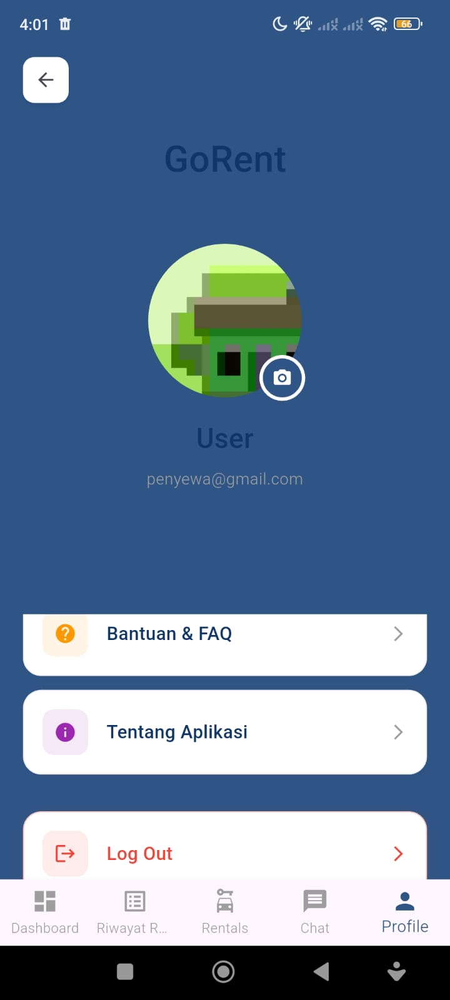

### Riwayat Chat (Penyewa)
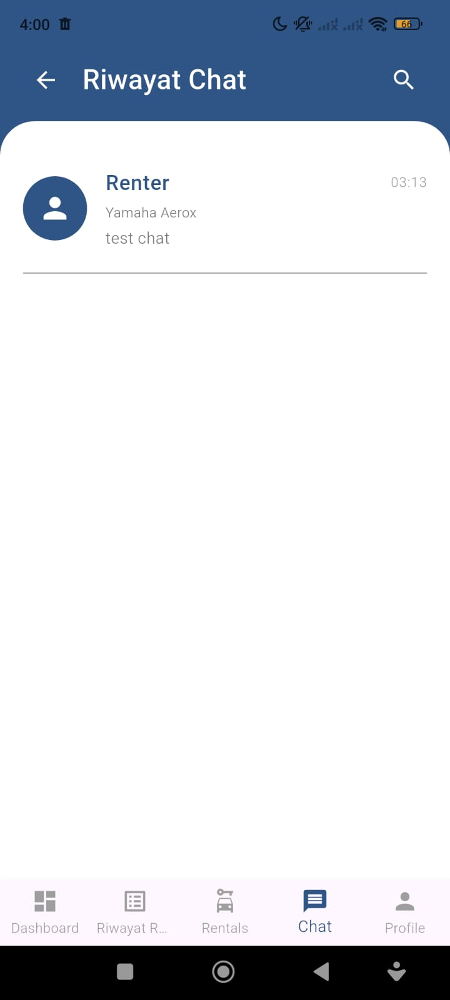

### Chat POV (Penyewa)
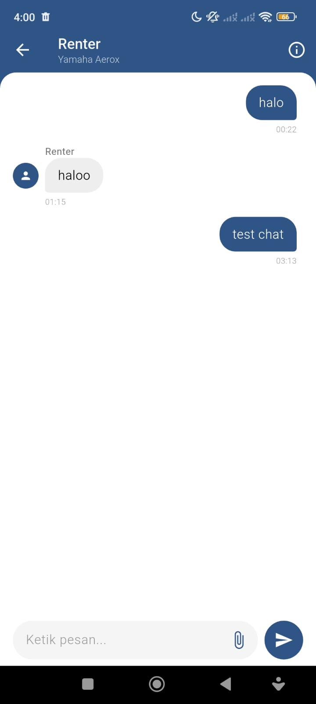

---

## 🎥 Demo Tampilan Aplikasi (GIF)

---
